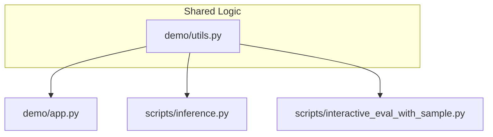

# Code Refactoring Plan

The goal is to centralize the dataset configurations and utility functions to avoid code duplication across `demo/app.py`, `scripts/inference.py`, and `scripts/interactive_eval_with_sample.py`.

## Tasks

- [x] Centralize `DATASET_CONFIGS` and utility functions in `demo/utils.py`
- [x] Refactor `scripts/inference.py` to use shared utilities
- [x] Refactor `scripts/interactive_eval_with_sample.py` to use shared utilities
- [x] Verify that all components (app and scripts) function correctly after refactoring
- [x] Remove redundant code in scripts

## Proposed Architecture

