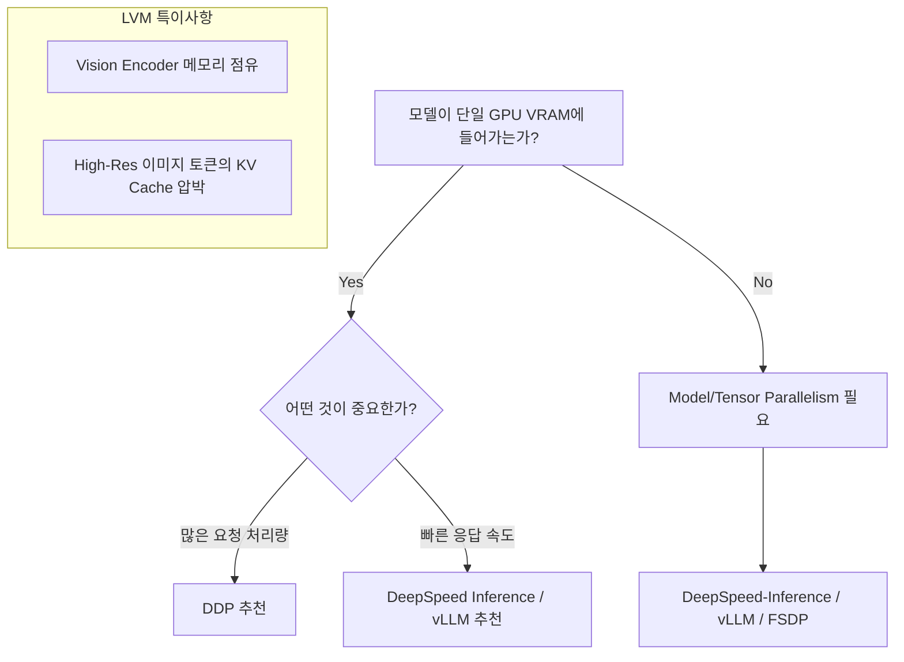

# Multi-GPU Strategy Guide for LVM (Large Vision Model)

LVM(Large Vision Model) 개발 및 추론 시 Multi-GPU 전략은 모델의 크기와 서비스 목표(Throughput vs Latency)에 따라 달라집니다. 모델이 단일 GPU 메모리(VRAM)에 올라간다면 DDP가 가장 효율적이지만, 모델이 너무 크거나 응답 속도가 중요하다면 Tensor Parallelism(DeepSpeed Inference 등)이 필요합니다.

## 1. Multi-GPU 전략 비교

### 1.1 DDP (Distributed Data Parallel)
*   **방식**: 각 GPU에 모델 전체를 복제(Replication)하고, 데이터를 나누어 처리합니다.
*   **추론 시 장점**: 구현이 매우 간단하며, 여러 요청을 동시에 처리하는 처리량(Throughput) 극대화에 유리합니다.
*   **한계**: 모델의 파라미터와 추론 시 필요한 KV Cache, Vision Encoder의 중간 결과물 등이 단일 GPU VRAM에 모두 들어가야 합니다.
*   **적합한 경우**: 7B~13B 수준의 모델을 다수의 GPU에서 병렬로 서빙할 때.

### 1.2 FSDP (Fully Sharded Data Parallel)
*   **방식**: 모델 파라미터를 여러 GPU에 나누어 저장(Sharding)합니다.
*   **추론 시 특징**: 주로 학습용으로 설계되었으며, 추론 시에는 매 레이어마다 파라미터를 모으는(All-gather) 통신 비용이 발생하여 Latency가 느려질 수 있습니다.
*   **적합한 경우**: 모델이 너무 커서 단일 GPU에 올릴 수 없는데, 전용 추론 엔진(vLLM 등)을 사용하기 어려운 연구 단계일 때.

### 1.3 DeepSpeed Inference (Tensor Parallelism)
*   **방식**: 행렬 연산 자체를 쪼개서 여러 GPU가 동시에 계산합니다.
*   **장점**: 단일 요청에 대한 **응답 속도(Latency)**를 획기적으로 줄일 수 있으며, 거대 모델 서빙에 필수적입니다.
*   **단점**: GPU 간 통신 대역폭(NVLink 등)이 중요하며 설정이 복잡할 수 있습니다.
*   **적합한 경우**: 30B 이상의 대형 LVM, 혹은 실시간성이 중요한 서비스.

## 2. 전략 선택 가이드 (LVM 기준)

## 3. LVM 개발 시 고려할 핵심 포인트

*   **Vision Encoder의 비중**: LVM은 LLM과 달리 거대한 Vision Encoder(ViT-L/G 등)가 메모리를 상시 점유합니다. 고해상도 이미지를 처리할 경우 생성되는 Visual Token 수가 급증하여 KV Cache 메모리 부족이 빨리 발생할 수 있습니다.
*   **추론 전용 프레임워크 권장**: 직접 DDP나 DeepSpeed를 구현하기보다, 내부적으로 Tensor Parallelism을 최적화하여 지원하는 vLLM이나 SGLang 같은 엔진을 사용하는 것이 LVM 추론에서 훨씬 높은 성능을 보여줍니다.
