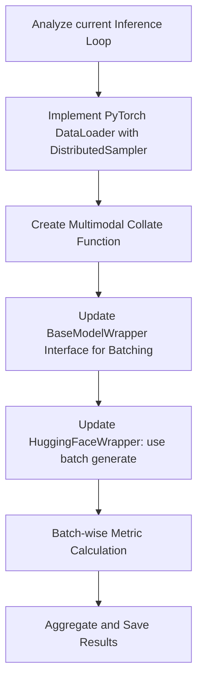

# Batch Inference Development Plan

This document outlines the plan for implementing batch inference in the evaluation pipeline to improve throughput without compromising model performance.

## 1. Overview
Currently, `scripts/inference.py` processes samples one by one (Batch Size = 1). While DDP provides horizontal scaling across multiple GPUs, implementing batching within each GPU will significantly increase throughput by maximizing GPU utilization.

## 2. Technical Requirements

### 2.1 DataLoader & Collate Function
- Replace manual dataset sharding with a standard PyTorch `DataLoader`.
- Implement a `collate_fn` to handle multimodal inputs:
    - **Text**: Pad sequences to the maximum length in the batch.
    - **Images**: Ensure all images in a batch are resized to the same dimensions (already handled by processors, but needs verification for batching).
    - **Attention Masks**: Generate proper masks to ignore padding tokens during generation.

### 2.2 Model Wrapper Updates
- **HuggingFaceWrapper**: Update `generate_content` to accept batch inputs and utilize Hugging Face's built-in batch generation capabilities.

## 3. Implementation Workflow

## 4. Considerations
- **Memory Management**: Batching increases VRAM usage. Need to implement a configurable `batch_size` parameter.
- **Consistency**: Ensure that `skip_special_tokens` and other generation parameters are consistently applied across the batch.
- **Post-processing**: Decoded strings must be correctly mapped back to their original IDs and metadata.

## 5. Future Steps
1. Create a branch for batch inference development.
2. Implement `DataLoader` in a new `scripts/inference_batch.py` for testing.
3. Benchmarking speed improvements vs. VRAM usage across different batch sizes (e.g., 2, 4, 8).
